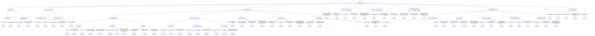

# Course Plan Mind Map

```mermaid
graph TD
  A((STEM Journey)) --> B[Foundation]
  B --> B1["MIT Scratch"]
  B1 -->|"Block-based logic"| B1a
  B1 -->|"Intro to loops/variables"| B1b
  B --> B2["Swift Playgrounds"]
  B2 -->|"Transition to text-based"| B2a
  B2 -->|"Interactive puzzles & app prototypes"| B2b

  A --> C["Introduction to Python"]
  C --> C1["Basic Syntax & Concepts"]
  C1 -->|"Variables, Data Types"| C1a
  C1 -->|"Control Flow, Functions"| C1b
  C --> C2["Core Python Projects"]
  C2 -->|"Command-line apps"| C2a
  C2 -->|"Data manipulation & visualization"| C2b
  C2 -->|"Project-based learning"| C2c

  A --> D["Branching Paths"]
  
  D --> D1["Web Development"]
  D1 --> D11["Front-End"]
  D11 -->|"HTML/CSS"| D11a
  D11 -->|"JavaScript (React, Vue, Angular)"| D11b
  D11 -->|"UI/UX Concepts"| D11c
  D11 -->|"Roles: Front-End Dev, Web Designer, UI/UX Engineer"| D11d

  D1 --> D12["Back-End"]
  D12 -->|"Server-Side Frameworks (Django, Flask, Node.js)"| D12a
  D12 -->|"Databases (SQL, NoSQL)"| D12b
  D12 -->|"API Design"| D12c
  D12 -->|"Roles: Back-End Dev, Database Admin, DevOps Engineer"| D12d

  D1 --> D13["Full-Stack"]
  D13 -->|"Combination of Front-End & Back-End"| D13a
  D13 -->|"Deployment & Cloud Services"| D13b
  D13 -->|"Roles: Full-Stack Dev, Technical Lead"| D13c

  D --> D2["Mobile App Development"]
  D2 --> D21["iOS (Swift)"]
  D21 -->|"Xcode & UIKit/SwiftUI"| D21a
  D21 -->|"App Store Processes"| D21b
  D21 -->|"Roles: iOS Dev, Mobile UI Designer"| D21c

  D2 --> D22["Android (Java/Kotlin)"]
  D22 -->|"Android Studio & Gradle"| D22a
  D22 -->|"Play Store Publishing"| D22b
  D22 -->|"Roles: Android Dev, Mobile Architect"| D22c

  D2 --> D23["Cross-Platform"]
  D23 -->|"Flutter (Dart), React Native"| D23a
  D23 -->|"Shared codebase"| D23b
  D23 -->|"Roles: Cross-Platform Dev, Mobile Solutions Engineer"| D23c

  D --> D3["Data Science & AI"]
  D3 -->|"Data Handling (Pandas, NumPy)"| D3a
  D3 -->|"Machine Learning (scikit-learn, TensorFlow)"| D3b
  D3 -->|"Deep Learning (PyTorch, Keras)"| D3c
  D3 -->|"Roles: Data Scientist, ML Engineer, Research Scientist"| D3d

  D --> D4["Robotics & IoT"]
  D4 -->|"Arduino/Raspberry Pi (C++ or Python)"| D4a
  D4 -->|"Sensors & Actuators"| D4b
  D4 -->|"ROS (Robot Operating System)"| D4c
  D4 -->|"Roles: Robotics Engineer, IoT Specialist, Embedded Systems Engineer"| D4d

  D --> D5["Cybersecurity"]
  D5 -->|"Network Security (OSI Layers, Protocols)"| D5a
  D5 -->|"Penetration Testing (Kali Linux, Metasploit)"| D5b
  D5 -->|"Cryptography Basics"| D5c
  D5 -->|"Roles: Security Analyst, Pen Tester, Security Engineer"| D5d

  A --> E["Mentorship & Community"]
  E -->|"Mentors from Tech Companies (Meta, Apple, Google...)"| E1
  E -->|"Webinars & Career Guidance"| E2
  E -->|"Q&A, Code Reviews"| E3
  E -->|"Peer Support & Study Groups"| E4

  A --> F["Goal-Setting & Milestones"]
  F -->|"Personal Roadmap (Short-Term: Projects, Long-Term: Portfolio)"| F1
  F -->|"Resume & Portfolio Review"| F2
  F -->|"Mock Interviews, Showcase Projects Online"| F3

  A --> G["Advanced & Specialized Learning"]
  G -->|"Internships & Co-op Programs"| G1
  G -->|"Research Opportunities (University Labs, R&D)"| G2
  G -->|"Entrepreneurial/Startup Path"| G3
  G -->|"Continuous Learning (Certifications, Online Courses)"| G4

  A --> H["Extra STEM Branches"]
  H --> H1["Game Development"]
  H1 -->|"Unity (C#), Unreal (C++)"| H1a
  H1 -->|"2D/3D, VR/AR"| H1b
  H1 -->|"Roles: Game Developer, Level Designer"| H1c

  H --> H2["Bioinformatics"]
  H2 -->|"Genomic Data Analysis (R, Python)"| H2a
  H2 -->|"Machine Learning in Healthcare"| H2b
  H2 -->|"Roles: Bioinformatics Scientist, Computational Biologist"| H2c

  H --> H3["Quantum Computing"]
  H3 -->|"Qiskit (Python), Q#"| H3a
  H3 -->|"Quantum Algorithms & Mechanics"| H3b
  H3 -->|"Roles: Quantum Developer, Research Scientist"| H3c

  H --> H4["Renewable Energy Tech"]
  H4 -->|"Power Systems Simulation"| H4a
  H4 -->|"IoT for Smart Grids"| H4b
  H4 -->|"Roles: Energy Analyst, IoT Engineer"| H4c

  H --> H5["Space & Aeronautics"]
  H5 -->|"Satellite Data Analysis"| H5a
  H5 -->|"Orbital Mechanics & Simulation"| H5b
  H5 -->|"Roles: Aerospace Engineer, Astrodynamics Specialist"| H5c

  A --> I["Implementation Tips"]
  I -->|"Modular Curriculum"| I1
  I -->|"Project-Based Approach"| I2
  I -->|"Hands-On Workshops"| I3
  I -->|"Community Events (STEM fairs, Hackathons)"| I4
  I -->|"Scholarships & Support"| I5
```
